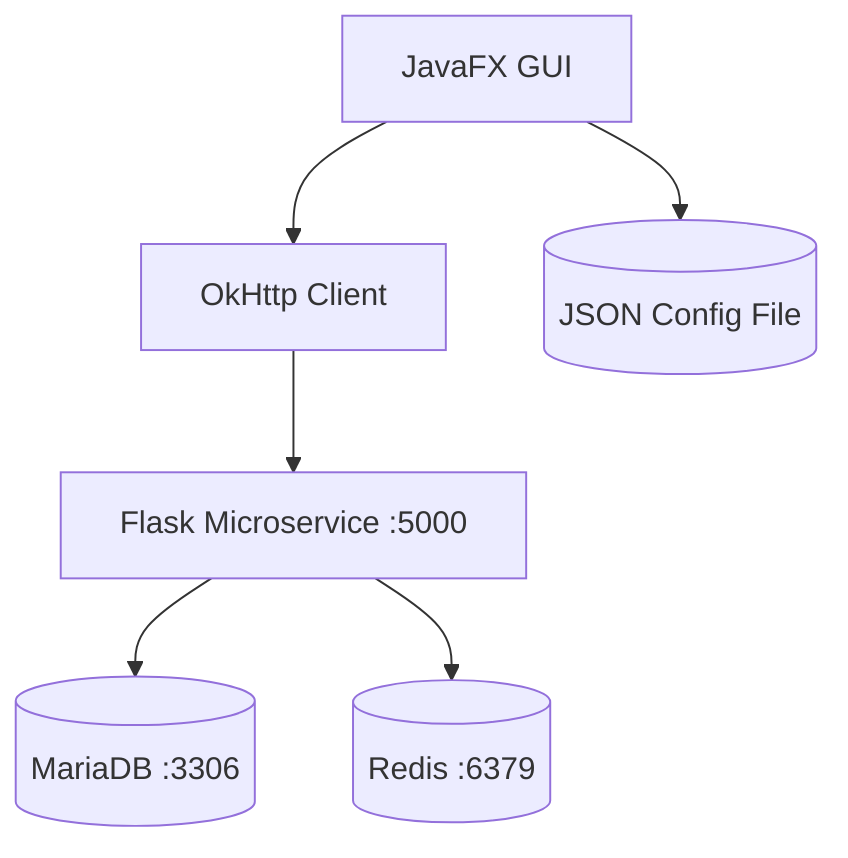
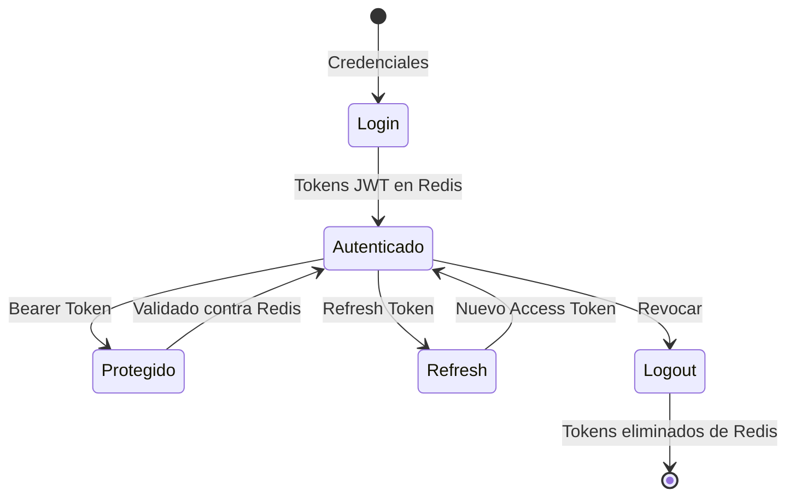

# Cliente GUI JavaFX para Microservicio JWT


## Vista Previa


## Descripción

Cliente JavaFX moderno para consumir el microservicio JWT. Interfaz gráfica nativa con autenticación completa, gestión de tokens JWT y operaciones protegidas.

## Arquitectura



**Nota**: Los tokens JWT se gestionan únicamente en Redis, no se almacenan localmente.

## Flujo de Autenticación



## Tecnologías

- **JavaFX**: UI nativa moderna
- **OkHttp**: Cliente HTTP
- **Jackson**: JSON processing
- **Maven**: Build system

## Inicio Rápido

```bash
# Requisitos: JDK 17+, Maven 3.6+, Microservicio JWT corriendo

# Ejecutar
mvn clean compile
mvn javafx:run
```

## Configuración

**JSON Config File**: Archivo local que guarda la configuración del cliente (IP, puerto, URLs de endpoints). Se genera automáticamente y permite cambiar la conexión al microservicio sin recompilar.

```json
{
  "ip": "localhost",
  "port": "5000",
  "endpoints": {
    "register": "/register",
    "login": "/login",
    "protected": "/protected",
    "refresh": "/refresh",
    "logout": "/logout",
    "users": "/users"
  }
}
```

## Estructura del Proyecto

```
cliente-jwt-gui/
├── src/main/java/com/example/jwttest/
│   ├── Main.java              # Entry point
│   └── JWTController.java     # Business logic
├── src/main/resources/jwt-gui.fxml
├── pom.xml
└── README.md
```

```bash
cliente-jwt-gui/
├── src/main/java/com/example/jwttest/Main.java
├── src/main/java/com/example/jwttest/JWTController.java
├── src/main/resources/jwt-gui.fxml
├── pom.xml
├── jwt_gui_config.json
└── README.md
```

