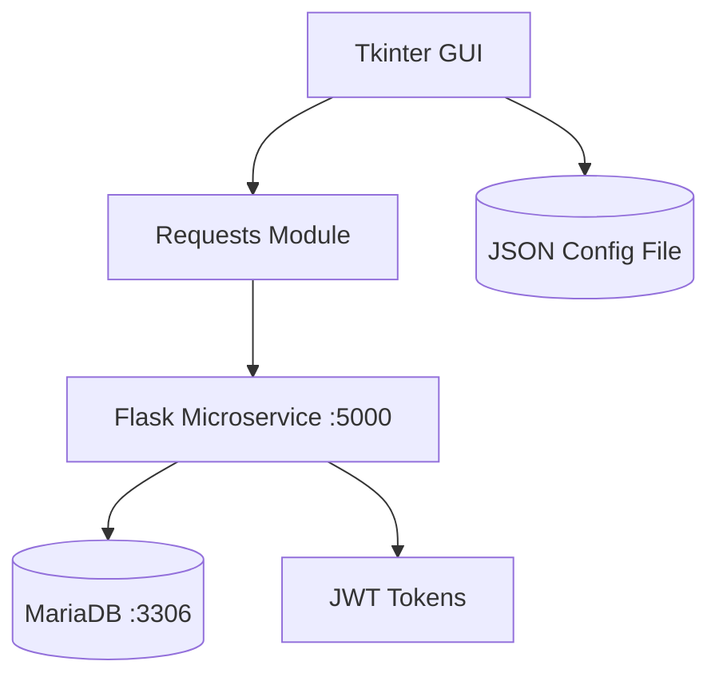
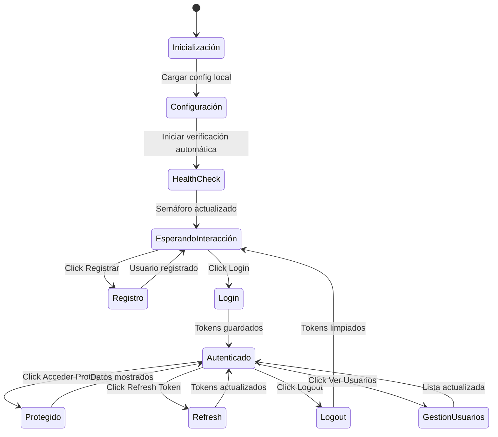

# Cliente GUI para Microservicio JWT


## Descripción

Este proyecto es una aplicación GUI completa desarrollada en Python utilizando Tkinter como framework principal para la interfaz gráfica. La aplicación sirve como cliente para consumir y gestionar todos los endpoints del microservicio JWT, proporcionando una experiencia visual intuitiva para operaciones de autenticación. Implementa un diseño modular con frames organizados, widgets interactivos, sistema de logging en tiempo real, semáforo visual de estado, y persistencia de configuración y tokens JWT en almacenamiento local.

## Arquitectura del Sistema



## Características de la GUI Tkinter

- ✅ **Interfaz Modular**: Frames organizados (ttk.LabelFrame) para cada funcionalidad
- ✅ **Widgets Interactivos**: Botones, entradas de texto, y controles ttk estilizados
- ✅ **Sistema de Logging Visual**: ScrolledText con timestamps para seguimiento en tiempo real
- ✅ **Semáforo Dinámico**: Canvas con círculos de colores que cambian según estado del servicio
- ✅ **Treeview para Datos**: Tabla estructurada para mostrar lista de usuarios
- ✅ **Validación de Formularios**: Verificación de campos requeridos con messagebox
- ✅ **Feedback Visual Inmediato**: Labels que muestran tokens actuales y estado
- ✅ **Configuración Persistente**: Campos de entrada que cargan y guardan configuración
- ✅ **Hilos para Responsividad**: Threading para operaciones de red sin bloquear la UI
- ✅ **Manejo de Eventos**: Callbacks asociados a botones con lógica de negocio
- ✅ **Layout Responsivo**: Grid system con weights para expansión adecuada
- ✅ **Colores y Estilos**: Tema ttk con colores significativos (azul para access, verde para refresh)

## Diseño de la Interfaz Tkinter

La aplicación utiliza Tkinter para crear una interfaz gráfica moderna y funcional, organizada en frames y widgets que facilitan la interacción con el microservicio JWT.

### Componentes Tkinter Utilizados

- **ttk.Frame**: Contenedores organizados para seccionar la interfaz
- **ttk.LabelFrame**: Frames con títulos descriptivos
- **ttk.Entry**: Campos de texto para entrada de datos
- **ttk.Button**: Botones interactivos con comandos asociados
- **tk.Canvas**: Dibujo del semáforo de salud
- **ttk.Treeview**: Tabla para mostrar lista de usuarios
- **scrolledtext.ScrolledText**: Área de texto con scroll para logs
- **tk.Tk**: Ventana principal de la aplicación

### Gestión de Eventos

- **Command callbacks**: Cada botón ejecuta un método específico
- **Threading**: Health checks en hilo separado para no bloquear UI
- **Event loop**: Mainloop de Tkinter maneja todos los eventos
- **State management**: Variables de instancia mantienen el estado de la aplicación

## Flujo de Interacción GUI



## Prerrequisitos

- Python 3.7 o superior
- Tkinter (incluido en la mayoría de instalaciones Python)
- Microservicio JWT corriendo (puerto 5000 por defecto)
- Puertos disponibles para el microservicio

## Instalación

1. **Clona el repositorio**
   ```bash
   git clone <url-del-repositorio>
   cd jwt-microservice
   ```

2. **Instala dependencias**
   ```bash
   pip install requests
   ```

3. **Ejecuta la aplicación**
   ```bash
   python jwt_gui.py
   ```

## Configuración

### Archivo de Configuración (jwt_gui_config.json)

La aplicación crea automáticamente un archivo `jwt_gui_config.json` para almacenar:

```json
{
  "ip": "localhost",
  "port": "5000",
  "endpoints": {
    "register": "/register",
    "login": "/login",
    "refresh": "/refresh",
    "logout": "/logout",
    "protected": "/protected",
    "health": "/health",
    "users": "/users",
    "delete_user": "/users/"
  },
  "access_token": "",
  "refresh_token": ""
}
```

### Configuración Inicial

- **IP**: Dirección del microservicio (por defecto: localhost)
- **Puerto**: Puerto del microservicio (por defecto: 5000)
- **Endpoints**: URLs de los servicios REST

## Uso

### Interfaz de la GUI

La aplicación se divide en secciones organizadas:

1. **Configuración del Microservicio**: Campos para IP y puerto
2. **Estado del Microservicio**: Semáforo visual con indicador de salud
3. **Registro de Usuario**: Campos para crear nueva cuenta
4. **Inicio de Sesión**: Campos para autenticación
5. **Acciones Autenticadas**: Botones para operaciones con tokens
6. **Gestión de Usuarios**: Ver y eliminar usuarios
7. **Log de Operaciones**: Historial detallado de todas las acciones
8. **Información de Tokens JWT**: Display de tokens actuales

### Semáforo de Salud

- 🔴 **Rojo**: Microservicio no funciona
- 🟠 **Naranja**: Procesando verificación
- 🟢 **Verde**: Microservicio saludable

### Funcionalidades Principales

#### Registro de Usuario
- Campos: Usuario, Email, Contraseña
- Validación de campos requeridos
- Logging de la solicitud y respuesta

#### Login
- Campos: Usuario, Contraseña
- Almacenamiento automático de tokens
- Actualización de labels de tokens

#### Acceso Protegido
- Requiere token de acceso válido
- Muestra datos protegidos en log

#### Refresh Token
- Utiliza refresh token para obtener nuevo access token
- Actualiza tokens almacenados

#### Logout
- Revoca tokens en el servidor
- Limpia tokens locales

#### Gestión de Usuarios
- Ver lista completa de usuarios
- Eliminar usuarios (solo el propio usuario)

## Tecnologías GUI Utilizadas

- **Tkinter**: Framework estándar de Python para interfaces gráficas
- **ttk (Themed Tkinter)**: Widgets modernos y estilizados
- **tk.Canvas**: Para dibujar elementos gráficos (semáforo)
- **scrolledtext.ScrolledText**: Área de texto con barras de scroll
- **ttk.Treeview**: Widget de tabla para datos estructurados
- **Threading**: Para mantener la responsividad de la interfaz
- **Python Requests**: Cliente HTTP integrado con la GUI
- **JSON**: Persistencia de configuración y tokens
- **Datetime**: Timestamps para logging visual

## Mejores Prácticas Implementadas

### Código
- **Constantes**: Definición de constantes para valores fijos
- **Manejo de Errores**: Try-except comprehensivo en todas las operaciones HTTP
- **Separación de Responsabilidades**: Métodos dedicados para cada funcionalidad
- **Logging Detallado**: Seguimiento completo de operaciones
- **Configuración Persistente**: Almacenamiento local de estado

### Interfaz
- **Diseño Intuitivo**: Layout organizado con frames lógicos
- **Feedback Visual**: Semáforo, colores y mensajes de estado
- **Validación**: Verificación de campos requeridos
- **Responsividad**: No bloquea la UI durante operaciones

### Seguridad
- **Almacenamiento Seguro**: Tokens en archivo local (no en memoria volátil)
- **Timeouts**: Límites de tiempo para evitar hangs
- **Validación de Tokens**: Verificación antes de operaciones
- **Limpieza**: Eliminación de tokens en logout

## Estructura del Proyecto

```
jwt-microservice/
├── jwt_gui.py              # Aplicación GUI principal
├── jwt_gui_config.json     # Configuración persistente (generado)
├── README_GUI.md          # Este archivo
└── README.md              # README del microservicio
```

## Beneficios de Tkinter en la Implementación

### Experiencia de Usuario
- **Interfaz Nativa**: Widgets ttk con apariencia nativa del sistema operativo
- **Navegación Intuitiva**: Frames organizados lógicamente por funcionalidad
- **Feedback Visual**: Semáforo, colores y estados que cambian dinámicamente
- **Accesibilidad**: Labels descriptivos y validación de entradas

### Desarrollo con Tkinter
- **Sin Dependencias Externas**: Tkinter incluido en Python estándar
- **Event-Driven Programming**: Arquitectura basada en eventos y callbacks
- **Threading Integrado**: Mantiene UI responsiva durante operaciones de red
- **Layout Management**: Sistema de grid flexible y potente

### Ventajas Técnicas
- **Modularidad**: Cada frame es un componente independiente
- **Reutilización**: Widgets configurables para diferentes contextos
- **Persistencia Visual**: Estado de la interfaz refleja estado de la aplicación
- **Debugging Visual**: Log integrado permite seguimiento inmediato de operaciones

