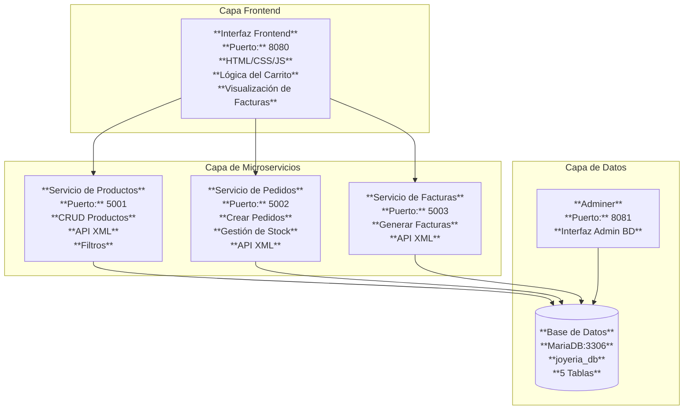
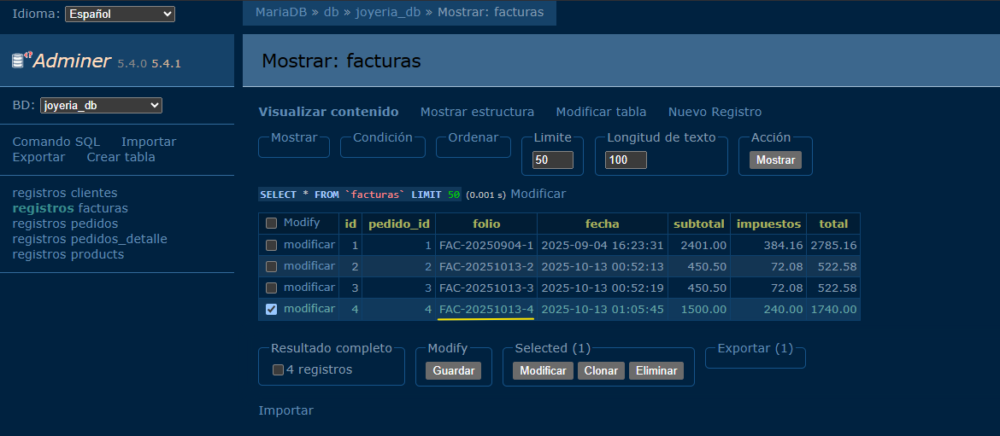
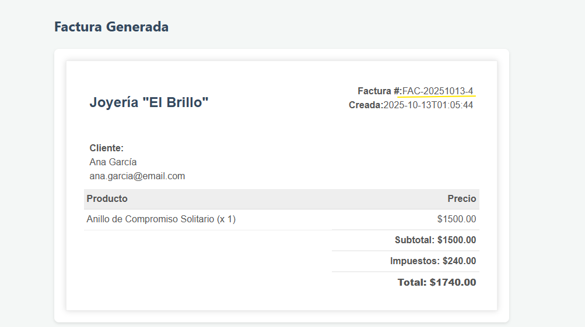

# Sistema E-commerce con Microservicios - Joyería "El Brillo"

       

Un sistema de comercio electrónico basado en microservicios para una joyería, desarrollado con Python Flask, MariaDB y Docker. El sistema permite gestionar productos, pedidos y facturas a través de una interfaz web moderna.

## 📋 Tabla de Contenidos

- [Características](#-características)
- [Arquitectura](#-arquitectura)
- [Tecnologías Utilizadas](#-tecnologías-utilizadas)
- [Requisitos Previos](#-requisitos-previos)
- [Instalación y Configuración](#-instalación-y-configuración)
- [Uso](#-uso)
- [Documentación de APIs](#-documentación-de-apis)
- [Base de Datos](#-base-de-datos)
- [Despliegue con Docker](#-despliegue-con-docker)

## ✨ Características

- **Arquitectura de Microservicios**: Servicios independientes para productos, pedidos y facturas
- **Interfaz Web Moderna**: Frontend responsivo con JavaScript vanilla
- **APIs XML**: Comunicación entre servicios usando XML
- **Gestión de Inventario**: Control de stock en tiempo real
- **Sistema de Facturación**: Generación automática de facturas con XSLT
- **Base de Datos Relacional**: MariaDB con integridad referencial
- **Containerización**: Despliegue completo con Docker y Docker Compose
- **Configuración Automática**: Detección automática de IPs y URLs

## 🏗️ Arquitectura

El sistema está compuesto por 4 microservicios principales:



### Interfaz Principal


*Vista principal del sistema mostrando el catálogo de productos y el carrito de compras*

## 🛠️ Tecnologías Utilizadas

- **Backend**: Python 3.9+, Flask 2.x
- **Base de Datos**: MariaDB 10.6+
- **Frontend**: HTML5, CSS3, JavaScript (ES6+)
- **Containerización**: Docker & Docker Compose
- **APIs**: RESTful con respuestas XML
- **Transformación**: XSLT para renderizado de facturas
- **ORM**: Flask-MySQLdb
- **CORS**: Flask-CORS para comunicación entre servicios

## 📋 Requisitos Previos

- Docker Engine 20.10+
- Docker Compose 1.29+
- 4GB RAM mínimo
- 10GB espacio en disco
- Puerto 8080 disponible (frontend)
- Puertos 5001-5003 disponibles (microservicios)
- Puerto 3306 disponible (MariaDB)
- Puerto 8081 disponible (Adminer)

## 🚀 Instalación y Configuración

### 1. Clonar el Repositorio

```bash
git clone <repository-url>
cd Sistema-Ecommerce-con-Microservicios-Python-Flask
```

### 2. Configurar Variables de Entorno

El archivo `.env` contiene las credenciales de base de datos:

```env
MYSQL_ROOT_PASSWORD=123
MYSQL_DATABASE=joyeria_db
MYSQL_USER=raul
MYSQL_PASSWORD=123
```

**Nota:** El archivo `.env` se incluye en el repositorio ya que este es solo un ejercicio de prueba, facilitando el despliegue local.

### 3. Construir y Ejecutar con Docker

```bash
# Construir todas las imágenes
docker-compose build

# Iniciar todos los servicios
docker-compose up -d

# Ver logs de todos los servicios
docker-compose logs -f

# Detener servicios
docker-compose down
```

### 4. Verificar Instalación

Acceder a las siguientes URLs:

- **Frontend**: http://localhost:8080
- **Adminer (DB Admin)**: http://localhost:8081
- **API Products**: http://localhost:5001/api/products
- **API Pedidos**: http://localhost:5002/api/pedidos
- **API Facturas**: http://localhost:5003/api/facturas

## 💻 Uso

### Navegación por el Sistema

1. **Catálogo de Productos**: Visualiza todos los productos disponibles con precios y stock
2. **Carrito de Compras**: Agrega productos al carrito y calcula totales automáticamente
3. **Crear Pedido**: Ingresa ID de cliente y confirma el pedido
4. **Generar Factura**: El sistema genera automáticamente una factura en formato XML transformado a HTML

### Ejemplo de Flujo de Compra

```javascript
// 1. Cargar productos
GET /api/products

// 2. Crear pedido
POST /api/pedidos
Content-Type: application/xml
Body: <pedido>
        <cliente_id>1</cliente_id>
        <item><id>1</id><cantidad>1</cantidad></item>
      </pedido>

// 3. Generar factura
POST /api/facturas
Content-Type: application/xml
Body: <factura><pedido_id>1</pedido_id></factura>
```

### Verificación de Base de Datos


*Vista de Adminer mostrando las tablas y datos de la base de datos*

## 📚 Documentación de APIs

### Products Service (Puerto 5001)

#### GET /api/products
Obtiene todos los productos.

**Respuesta XML:**
```xml
<products>
  <product>
    <id>1</id>
    <codigo>R001</codigo>
    <nombre>Anillo de Compromiso</nombre>
    <descripcion>Clásico anillo...</descripcion>
    <precio>1500.00</precio>
    <stock>10</stock>
    <material>Oro Blanco</material>
    <marca>Tiffany</marca>
    <kilates>18</kilates>
  </product>
</products>
```

#### GET /api/products/{id}
Obtiene un producto específico por ID.

#### GET /api/products/kilates/{kilates}
Filtra productos por kilates de oro.

#### GET /api/products/marca/{marca}
Filtra productos por marca.

#### GET /api/products/material/{material}
Filtra productos por material.

#### POST /api/products/create
Crea un nuevo producto.

**Body XML:**
```xml
<product>
  <codigo>P006</codigo>
  <nombre>Nuevo Producto</nombre>
  <descripcion>Descripción</descripcion>
  <precio>100.00</precio>
  <stock>5</stock>
  <material>Plata</material>
  <marca>Marca</marca>
  <kilates>18</kilates>
</product>
```

#### PUT /api/products/update/{id}
Actualiza un producto existente.

#### DELETE /api/products/delete/{id}
Elimina un producto.

### Pedidos Service (Puerto 5002)

#### POST /api/pedidos
Crea un nuevo pedido y actualiza el stock.

**Body XML:**
```xml
<pedido>
  <cliente_id>1</cliente_id>
  <item>
    <id>1</id>
    <cantidad>2</cantidad>
  </item>
</pedido>
```

**Respuesta XML:**
```xml
<response>
  <status>success</status>
  <pedido_id>1</pedido_id>
  <total>3200.00</total>
</response>
```

### Facturas Service (Puerto 5003)

#### POST /api/facturas
Genera una factura para un pedido existente.

**Body XML:**
```xml
<factura>
  <pedido_id>1</pedido_id>
</factura>
```

#### GET /api/facturas/{id}
Obtiene una factura específica por ID.

**Respuesta XML:**
```xml
<factura>
  <encabezado>
    <id>1</id>
    <folio>FAC-20250904-1</folio>
    <fecha>2025-09-04T16:23:31</fecha>
  </encabezado>
  <cliente>
    <nombre>Ana García</nombre>
    <email>ana.garcia@email.com</email>
  </cliente>
  <items>
    <item>
      <codigo>R001</codigo>
      <nombre>Anillo de Compromiso</nombre>
      <cantidad>1</cantidad>
      <precio_unitario>1500.00</precio_unitario>
      <importe>1500.00</importe>
    </item>
  </items>
  <totales>
    <subtotal>1500.00</subtotal>
    <impuestos>240.00</impuestos>
    <total>1740.00</total>
  </totales>
</factura>
```

### Factura Generada


*Ejemplo de factura generada y transformada con XSLT*

## 🗄️ Base de Datos

### Esquema

El sistema utiliza MariaDB con las siguientes tablas:

#### clientes
```sql
CREATE TABLE clientes (
  id INT AUTO_INCREMENT PRIMARY KEY,
  nombre VARCHAR(100) NOT NULL,
  email VARCHAR(100) NOT NULL UNIQUE,
  fecha_registro TIMESTAMP DEFAULT CURRENT_TIMESTAMP
);
```

#### products
```sql
CREATE TABLE products (
  id INT AUTO_INCREMENT PRIMARY KEY,
  codigo VARCHAR(50) NOT NULL UNIQUE,
  nombre VARCHAR(100) NOT NULL,
  descripcion TEXT,
  precio DECIMAL(10,2) NOT NULL,
  stock INT NOT NULL DEFAULT 0,
  material VARCHAR(50),
  marca VARCHAR(50),
  kilates INT,
  fecha_creacion TIMESTAMP DEFAULT CURRENT_TIMESTAMP
);
```

#### pedidos
```sql
CREATE TABLE pedidos (
  id INT AUTO_INCREMENT PRIMARY KEY,
  cliente_id INT,
  fecha TIMESTAMP DEFAULT CURRENT_TIMESTAMP,
  subtotal DECIMAL(10,2) NOT NULL,
  impuestos DECIMAL(10,2) NOT NULL,
  total DECIMAL(10,2) NOT NULL,
  estado VARCHAR(20) DEFAULT 'Procesando',
  FOREIGN KEY (cliente_id) REFERENCES clientes(id) ON DELETE SET NULL
);
```

#### pedidos_detalle
```sql
CREATE TABLE pedidos_detalle (
  id INT AUTO_INCREMENT PRIMARY KEY,
  pedido_id INT NOT NULL,
  producto_id INT NOT NULL,
  cantidad INT NOT NULL,
  precio_unitario DECIMAL(10,2) NOT NULL,
  FOREIGN KEY (pedido_id) REFERENCES pedidos(id) ON DELETE CASCADE,
  FOREIGN KEY (producto_id) REFERENCES products(id) ON DELETE CASCADE
);
```

#### facturas
```sql
CREATE TABLE facturas (
  id INT AUTO_INCREMENT PRIMARY KEY,
  pedido_id INT NOT NULL UNIQUE,
  folio VARCHAR(50) NOT NULL UNIQUE,
  fecha TIMESTAMP DEFAULT CURRENT_TIMESTAMP,
  subtotal DECIMAL(10,2) NOT NULL,
  impuestos DECIMAL(10,2) NOT NULL,
  total DECIMAL(10,2) NOT NULL,
  FOREIGN KEY (pedido_id) REFERENCES pedidos(id) ON DELETE CASCADE
);
```

### Datos de Ejemplo

La base de datos incluye datos de ejemplo:
- 2 clientes registrados
- 5 productos de joyería
- Pedidos y facturas de ejemplo

## 🐳 Despliegue con Docker

### Servicios en docker-compose.yml

```yaml
version: '3.8'
services:
  db:           # MariaDB Database
  products:     # Products Microservice
  pedidos:      # Orders Microservice
  facturas:     # Invoices Microservice
  frontend:     # Web Frontend
  adminer:      # Database Admin UI
```

### Comandos Útiles

```bash
# Ver estado de servicios
docker-compose ps

# Reiniciar un servicio específico
docker-compose restart products

# Ver logs de un servicio
docker-compose logs products

# Acceder al shell de un contenedor
docker-compose exec products bash

# Limpiar volúmenes y reconstruir
docker-compose down -v
docker-compose up --build
```

### Configuración de Red

Todos los servicios están conectados a la red `joyeria_network` para comunicación interna.

---

**Desarrollado como ejercicio práctico de Arquitectura de Microservicios con Python Flask y Docker.**